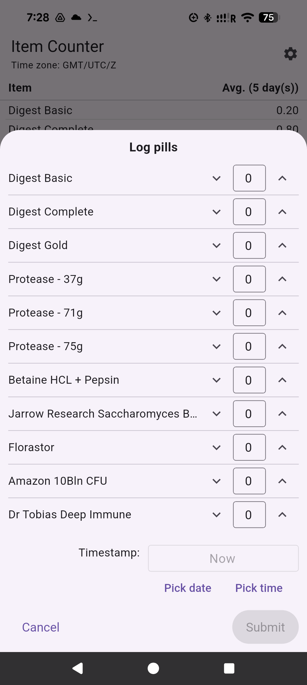

# Item Counter

An item counter.  I use it to (1) count my daily pill intake and (2) get a daily average of the # of pills taken.

---

Phase 1, where I built it for my own personal use

If you're interested in using the app, you'll probably want to do the following:
* Build a debug version (to an emulator is fine, although you'll probably want to deploy a debug version to the device that you'll use the app on, if only to create the directory structure)
* Take a copy of the DB file from /data/data/com.example.item_counter_standalone_app
* Add your preferred time zone(s) (and aliases to those time zones) to the time_zone_aliases table
* Add whatever it is you want to count to the items table.  (with display_order, 1 = the top of the list; values should probably be unique (although that's not enforced by the DB atm); with show_item: show_item == 1 => show; == 0 => don't show.)
* Copy the DB back to your phone
* Create a release .apk file and deploy it to your phone
  * That is, from the project root:
  * `flutter build apk --release`
  *  `adb install [relative path of the .apk file]`
    * eg. `adb install build/app/outputs/flutter-apk/app-release.apk`

---

Phase 2, where I make the app more accessible to others

* TBC! We'll write this up once we've made the project a bit less 'specific to my own uses.'

## FAQ!  
Q) Why?!  
A) I was using a spreadsheet to take daily averages of the # of pills I took each day, and figured I'd try making an app out of it.  And here's that app!  btw I use those averages to project when my current supply of pills will run out, how many bottles to bring when I travel, etc.

Q) Who are you, anyhow?  
A) Just some hobbyist.  Nothing to see here.

Q) I LOVE YOUR APP (/CODE) AND I WANT TO GIVE YOU MONEY  
A) Don't let me stop you! https://ko-fi.com/stevebrown0804
