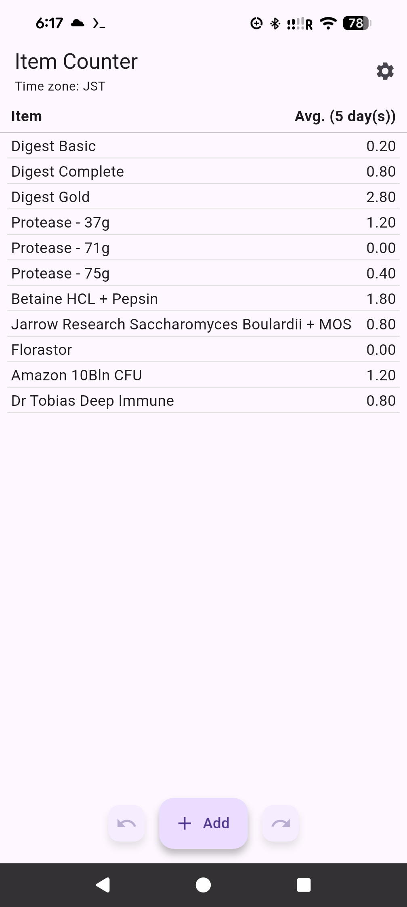
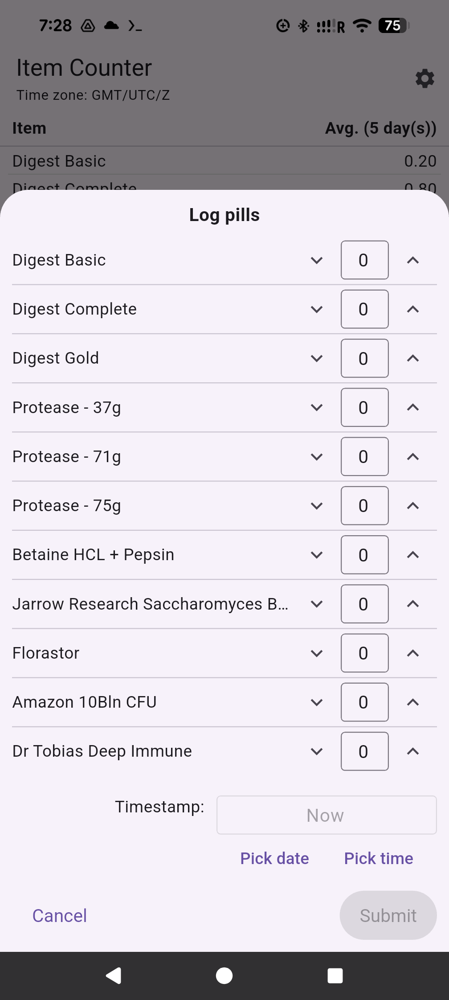
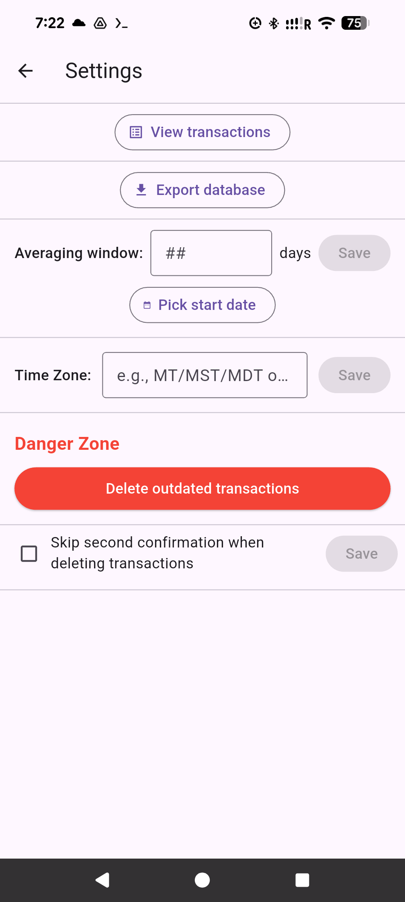
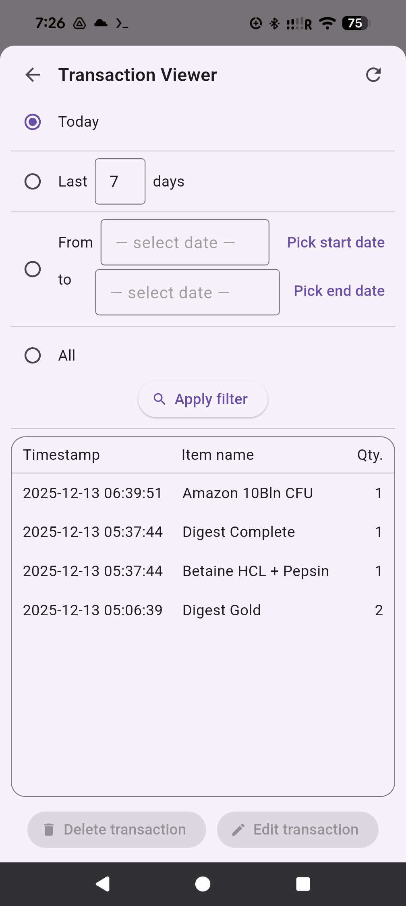

# Item Counter

An item counter.  I use it to (1) count my daily pill intake and (2) get a daily average of the # of pills taken.

---

Phase 1, where I built it for my own personal use (on an Android phone)

If you're interested in using the app, you'll probably want to do the following:
* Build a debug version (to an emulator is fine, although you'll probably want to deploy a debug version to the device that you'll use the app on, if only to create the directory structure)
* Take a copy of the DB file from /data/data/com.example.item_counter_standalone_app
* Add your preferred time zone(s) (and aliases to those time zones) to the time_zone_aliases table
* Add whatever it is you want to count to the items table.  (with display_order == 1 being the top of the list; values should probably be unique (although that's not enforced by the DB atm); with show_item: show_item == 1 => show; == 0 => don't show.)
* Copy the DB back to your phone
* Create a release .apk file and deploy it to your phone
  * That is, from the project root:
  * `flutter build apk --release`
  *  `adb install [relative path of the .apk file]`
    * eg. `adb install build/app/outputs/flutter-apk/app-release.apk`

---

Phase 2, where I make the app more accessible to others

* 2026-04-10 This phase is in progress now!🥳  Check the TODO.txt file if you want to see what I'm planning to do.  (The 'upper' section, that is.  The "Minor initiatives" and lower sections are TODOs that I wrote up the last time I was working on the project; we'll evaluate them to see if we still want to do them, eventually.)

---

### FAQ!  

Q) Why?   
A) I was using a spreadsheet to take daily averages of the # of pills I took each day, and figured I'd try making an app out of it.

And here's that app!

btw I use those daily averages to project when my current supply of pills will run out, to make sure I take enough pills with me when I travel, etc.

Q) Do you accept tips?  
A) Yep! https://ko-fi.com/stevebrown0804
